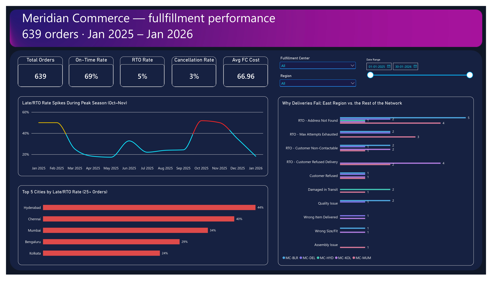
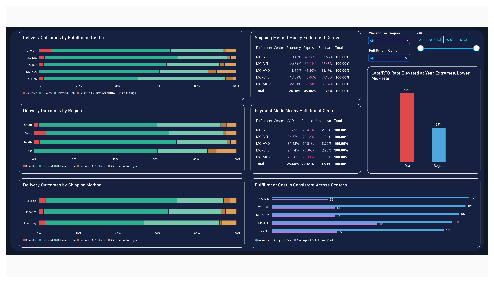

# Meridian Commerce — Fulfillment Performance Analytics

An end-to-end data analytics project covering data cleaning in Excel and Power Query, exploratory analysis, and a Power BI dashboard built to investigate rising delivery delays and RTOs at a fictional omnichannel retailer operating a 5-center fulfillment network across India.

---

## Tools

Excel · Power Query · Power BI · DAX

---

## Dashboard Preview

### Page 1 — Executive Logistics Overview

### Page 2 — Fulfillment Center & Root Cause Deep Dive

*📄 Want a printable view? Download the complete [Meridian_Dashboard.pdf](Meridian_Dashboard.pdf).*

---

## What the project covers

### Data Cleaning

The original raw dataset was provided in **CSV format** and contains 662 rows across 26 columns.

The CSV was imported into Excel, where the original data was preserved unchanged in a dedicated `Raw_Data` sheet. A separate `Cleaned_Data` sheet contains the cleaned dataset with flag columns.

The raw data contained the usual real world data quality issues, six different date formats in the same column, currency symbol encoding issues, missing values represented five different ways, duplicate records, and business rule violations.

**Raw records:** 662
**Cleaned records:** 639

### Exploratory Analysis

Used PivotTables to investigate which combinations of fulfillment center, region, shipping method, and time period were driving the problem, testing and ruling out hypotheses rather than simply reporting patterns.

One finding (an unusually high cost at the Bengaluru center) was retracted mid analysis after tracing it to a single outlier record.

---

## Key Findings

* **Late/RTO rate roughly doubles during peak season (Oct–Nov):** ~53% vs ~26% the rest of the year
* **Hyderabad FC has the highest late-delivery rate (45.5%):** partly linked to its COD order mix
* **East region's elevated RTO rate is driven by customer refusals, not address issues:** indicating a different failure mode requiring a different response
* **Economy shipping underperforms on every metric:** regardless of which fulfillment center uses it

---

## Power BI Dashboard

2-page dashboard with DAX measures, cross page slicers, and conditional formatting. Page 1 covers the executive overview and time trend; Page 2 covers fulfillment center performance, cost analysis, and root-cause breakdown.

---

## Project Files

| File | Description |
|---|---|
| `Meridian_Fulfillment_RAW_Dataset.csv` | Original raw dataset in CSV format (662 rows) |
| `Meridian_Fulfillment.xlsx` | Excel workbook containing the original raw data and cleaned dataset in separate sheets |
| `Meridian_Dashboard.pbix` | Power BI dashboard with DAX measures and visual analysis |
| `Meridian_Dashboard.pdf` | Static 2-page PDF export of the Power BI dashboard |
| `images/` | High-resolution dashboard screenshots embedded in the README preview |
